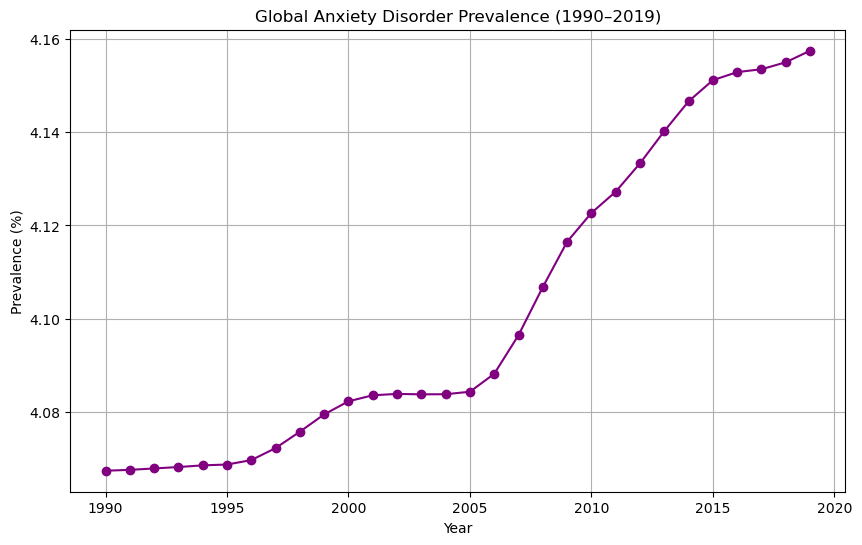
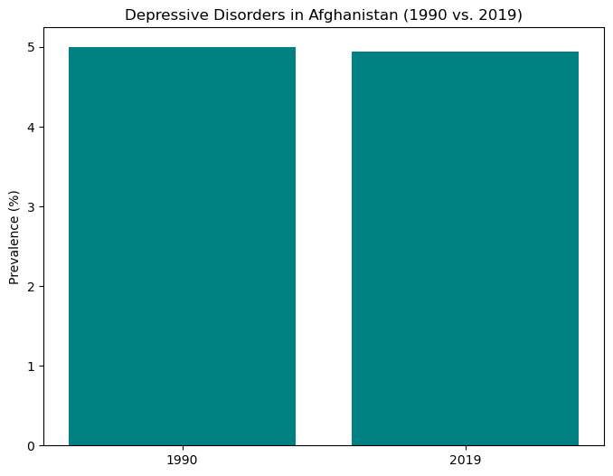
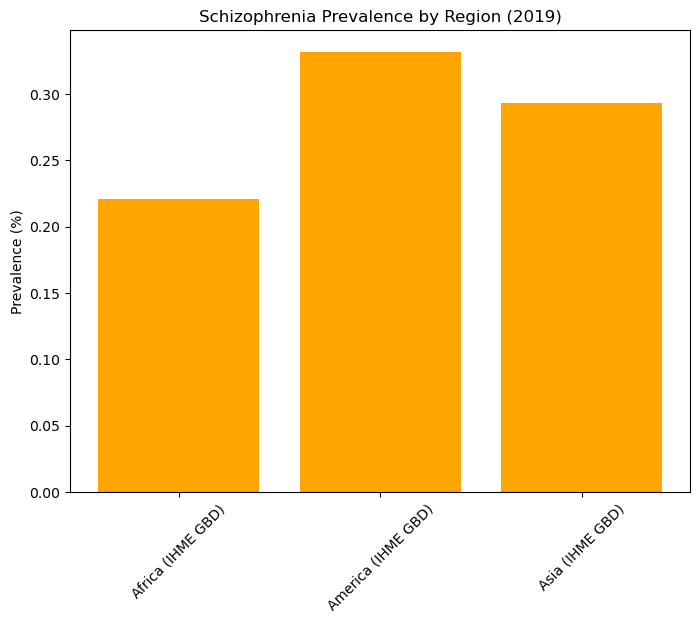
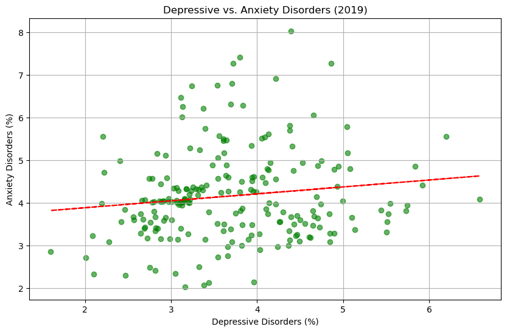
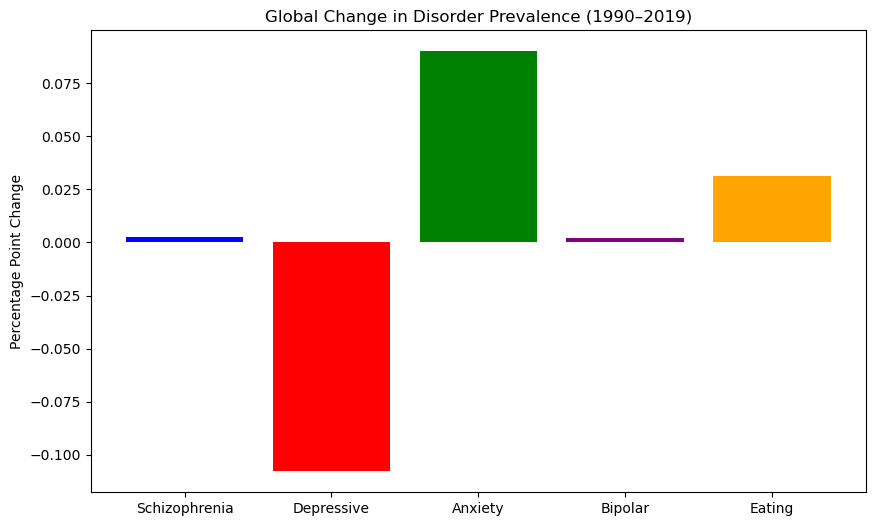
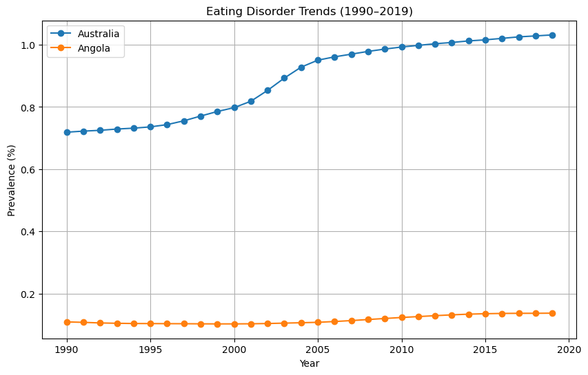

# Global Prevalence and Trends of Age-Standardized Mental Health Disorders by Country and Region, 1990-2019

# This title emphasizes the dataset’s scope (global coverage), focus (mental health disorders), methodology (age-standardized rates), timeframe (1990–2019), and analytical approach (comparative epidemiology). It succinctly communicates the dataset’s purpose and utility for research or policy analysis.


```python
import pandas as pd
```


```python
import matplotlib.pyplot as plt
```


```python
df = pd.read_csv("1- mental-illnesses-prevalence.csv")
```


```python

```


```python

```


```python

```


```python
import pandas as pd
import matplotlib.pyplot as plt

# Filter global data (example)
global_anxiety = df.groupby('Year')['Anxiety disorders (share of population) - Sex: Both - Age: Age-standardized'].mean()

plt.figure(figsize=(10, 6))
plt.plot(global_anxiety.index, global_anxiety.values, marker='o', color='purple')
plt.title('Global Anxiety Disorder Prevalence (1990–2019)')
plt.xlabel('Year')
plt.ylabel('Prevalence (%)')
plt.grid(True)
plt.savefig('Global_Anxiety_Disorder_Prevalence.png')
plt.show()
```


    

    


```python
afghanistan = df[df['Entity'] == 'Afghanistan'][['Year', 'Depressive disorders (share of population) - Sex: Both - Age: Age-standardized']]
afghanistan = afghanistan[afghanistan['Year'].isin([1990, 2019])]

plt.figure(figsize=(8, 6))
plt.bar(afghanistan['Year'].astype(str), afghanistan['Depressive disorders (share of population) - Sex: Both - Age: Age-standardized'], color='teal')
plt.title('Depressive Disorders in Afghanistan (1990 vs. 2019)')
plt.ylabel('Prevalence (%)')
plt.savefig('Depressive_disorders.png')
plt.show()
```


    

    


```python
regions = ['Africa (IHME GBD)', 'Asia (IHME GBD)', 'America (IHME GBD)']
schiz_2019 = df[(df['Year'] == 2019) & (df['Entity'].isin(regions))][['Entity', 'Schizophrenia disorders (share of population) - Sex: Both - Age: Age-standardized']]

plt.figure(figsize=(8, 6))
plt.bar(schiz_2019['Entity'], schiz_2019['Schizophrenia disorders (share of population) - Sex: Both - Age: Age-standardized'], color='orange')
plt.title('Schizophrenia Prevalence by Region (2019)')
plt.ylabel('Prevalence (%)')
plt.xticks(rotation=45)
plt.savefig('Schizopherenia.png')
plt.show()
```


    

    


```python
data_2019 = df[df['Year'] == 2019][['Depressive disorders (share of population) - Sex: Both - Age: Age-standardized', 
                                   'Anxiety disorders (share of population) - Sex: Both - Age: Age-standardized']]

plt.figure(figsize=(10, 6))
plt.scatter(data_2019['Depressive disorders (share of population) - Sex: Both - Age: Age-standardized'], 
            data_2019['Anxiety disorders (share of population) - Sex: Both - Age: Age-standardized'], 
            alpha=0.6, color='green')
plt.title('Depressive vs. Anxiety Disorders (2019)')
plt.xlabel('Depressive Disorders (%)')
plt.ylabel('Anxiety Disorders (%)')
plt.grid(True)

# Add regression line
import numpy as np
x = data_2019['Depressive disorders (share of population) - Sex: Both - Age: Age-standardized']
y = data_2019['Anxiety disorders (share of population) - Sex: Both - Age: Age-standardized']
z = np.polyfit(x, y, 1)
p = np.poly1d(z)
plt.plot(x, p(x), "r--")
plt.savefig('Schizopherenia.png')
plt.show()
```


    

    


```python
df.columns
```


    Index(['Entity', 'Code', 'Year',
           'Schizophrenia disorders (share of population) - Sex: Both - Age: Age-standardized',
           'Depressive disorders (share of population) - Sex: Both - Age: Age-standardized',
           'Anxiety disorders (share of population) - Sex: Both - Age: Age-standardized',
           'Bipolar disorders (share of population) - Sex: Both - Age: Age-standardized',
           'Eating disorders (share of population) - Sex: Both - Age: Age-standardized'],
          dtype='object')


```python
df

```


<div>
<style scoped>
    .dataframe tbody tr th:only-of-type {
        vertical-align: middle;
    }

    .dataframe tbody tr th {
        vertical-align: top;
    }

    .dataframe thead th {
        text-align: right;
    }
</style>
<table border="1" class="dataframe">
  <thead>
    <tr style="text-align: right;">
      <th></th>
      <th>Entity</th>
      <th>Code</th>
      <th>Year</th>
      <th>Schizophrenia disorders (share of population) - Sex: Both - Age: Age-standardized</th>
      <th>Depressive disorders (share of population) - Sex: Both - Age: Age-standardized</th>
      <th>Anxiety disorders (share of population) - Sex: Both - Age: Age-standardized</th>
      <th>Bipolar disorders (share of population) - Sex: Both - Age: Age-standardized</th>
      <th>Eating disorders (share of population) - Sex: Both - Age: Age-standardized</th>
      <th>Schizophrenia</th>
    </tr>
  </thead>
  <tbody>
    <tr>
      <th>0</th>
      <td>Afghanistan</td>
      <td>AFG</td>
      <td>1990</td>
      <td>0.223206</td>
      <td>4.996118</td>
      <td>4.713314</td>
      <td>0.703023</td>
      <td>0.127700</td>
      <td>0.223206</td>
    </tr>
    <tr>
      <th>1</th>
      <td>Afghanistan</td>
      <td>AFG</td>
      <td>1991</td>
      <td>0.222454</td>
      <td>4.989290</td>
      <td>4.702100</td>
      <td>0.702069</td>
      <td>0.123256</td>
      <td>0.222454</td>
    </tr>
    <tr>
      <th>2</th>
      <td>Afghanistan</td>
      <td>AFG</td>
      <td>1992</td>
      <td>0.221751</td>
      <td>4.981346</td>
      <td>4.683743</td>
      <td>0.700792</td>
      <td>0.118844</td>
      <td>0.221751</td>
    </tr>
    <tr>
      <th>3</th>
      <td>Afghanistan</td>
      <td>AFG</td>
      <td>1993</td>
      <td>0.220987</td>
      <td>4.976958</td>
      <td>4.673549</td>
      <td>0.700087</td>
      <td>0.115089</td>
      <td>0.220987</td>
    </tr>
    <tr>
      <th>4</th>
      <td>Afghanistan</td>
      <td>AFG</td>
      <td>1994</td>
      <td>0.220183</td>
      <td>4.977782</td>
      <td>4.670810</td>
      <td>0.699898</td>
      <td>0.111815</td>
      <td>0.220183</td>
    </tr>
    <tr>
      <th>...</th>
      <td>...</td>
      <td>...</td>
      <td>...</td>
      <td>...</td>
      <td>...</td>
      <td>...</td>
      <td>...</td>
      <td>...</td>
      <td>...</td>
    </tr>
    <tr>
      <th>6415</th>
      <td>Zimbabwe</td>
      <td>ZWE</td>
      <td>2015</td>
      <td>0.201042</td>
      <td>3.407624</td>
      <td>3.184012</td>
      <td>0.538596</td>
      <td>0.095652</td>
      <td>0.201042</td>
    </tr>
    <tr>
      <th>6416</th>
      <td>Zimbabwe</td>
      <td>ZWE</td>
      <td>2016</td>
      <td>0.201319</td>
      <td>3.410755</td>
      <td>3.187148</td>
      <td>0.538593</td>
      <td>0.096662</td>
      <td>0.201319</td>
    </tr>
    <tr>
      <th>6417</th>
      <td>Zimbabwe</td>
      <td>ZWE</td>
      <td>2017</td>
      <td>0.201639</td>
      <td>3.411965</td>
      <td>3.188418</td>
      <td>0.538589</td>
      <td>0.097330</td>
      <td>0.201639</td>
    </tr>
    <tr>
      <th>6418</th>
      <td>Zimbabwe</td>
      <td>ZWE</td>
      <td>2018</td>
      <td>0.201976</td>
      <td>3.406929</td>
      <td>3.172111</td>
      <td>0.538585</td>
      <td>0.097909</td>
      <td>0.201976</td>
    </tr>
    <tr>
      <th>6419</th>
      <td>Zimbabwe</td>
      <td>ZWE</td>
      <td>2019</td>
      <td>0.202482</td>
      <td>3.395476</td>
      <td>3.137017</td>
      <td>0.538580</td>
      <td>0.098295</td>
      <td>0.202482</td>
    </tr>
  </tbody>
</table>
<p>6420 rows × 9 columns</p>
</div>


```python
df["Schizophrenia"]=df["Schizophrenia disorders (share of population) - Sex: Both - Age: Age-standardized"]
```


```python
df['Depressive']=df['Depressive disorders (share of population) - Sex: Both - Age: Age-standardized']
```


```python
df['Anxiety']=df['Anxiety disorders (share of population) - Sex: Both - Age: Age-standardized']
```


```python
df['Bipolar']=df['Bipolar disorders (share of population) - Sex: Both - Age: Age-standardized']
```


```python
df['Eating']=df['Eating disorders (share of population) - Sex: Both - Age: Age-standardized']
```


```python
df
```


<div>
<style scoped>
    .dataframe tbody tr th:only-of-type {
        vertical-align: middle;
    }

    .dataframe tbody tr th {
        vertical-align: top;
    }

    .dataframe thead th {
        text-align: right;
    }
</style>
<table border="1" class="dataframe">
  <thead>
    <tr style="text-align: right;">
      <th></th>
      <th>Entity</th>
      <th>Code</th>
      <th>Year</th>
      <th>Schizophrenia disorders (share of population) - Sex: Both - Age: Age-standardized</th>
      <th>Depressive disorders (share of population) - Sex: Both - Age: Age-standardized</th>
      <th>Anxiety disorders (share of population) - Sex: Both - Age: Age-standardized</th>
      <th>Bipolar disorders (share of population) - Sex: Both - Age: Age-standardized</th>
      <th>Eating disorders (share of population) - Sex: Both - Age: Age-standardized</th>
      <th>Schizophrenia</th>
      <th>Depressive</th>
      <th>Anxiety</th>
      <th>Bipolar</th>
      <th>Eating</th>
    </tr>
  </thead>
  <tbody>
    <tr>
      <th>0</th>
      <td>Afghanistan</td>
      <td>AFG</td>
      <td>1990</td>
      <td>0.223206</td>
      <td>4.996118</td>
      <td>4.713314</td>
      <td>0.703023</td>
      <td>0.127700</td>
      <td>0.223206</td>
      <td>4.996118</td>
      <td>4.713314</td>
      <td>0.703023</td>
      <td>0.127700</td>
    </tr>
    <tr>
      <th>1</th>
      <td>Afghanistan</td>
      <td>AFG</td>
      <td>1991</td>
      <td>0.222454</td>
      <td>4.989290</td>
      <td>4.702100</td>
      <td>0.702069</td>
      <td>0.123256</td>
      <td>0.222454</td>
      <td>4.989290</td>
      <td>4.702100</td>
      <td>0.702069</td>
      <td>0.123256</td>
    </tr>
    <tr>
      <th>2</th>
      <td>Afghanistan</td>
      <td>AFG</td>
      <td>1992</td>
      <td>0.221751</td>
      <td>4.981346</td>
      <td>4.683743</td>
      <td>0.700792</td>
      <td>0.118844</td>
      <td>0.221751</td>
      <td>4.981346</td>
      <td>4.683743</td>
      <td>0.700792</td>
      <td>0.118844</td>
    </tr>
    <tr>
      <th>3</th>
      <td>Afghanistan</td>
      <td>AFG</td>
      <td>1993</td>
      <td>0.220987</td>
      <td>4.976958</td>
      <td>4.673549</td>
      <td>0.700087</td>
      <td>0.115089</td>
      <td>0.220987</td>
      <td>4.976958</td>
      <td>4.673549</td>
      <td>0.700087</td>
      <td>0.115089</td>
    </tr>
    <tr>
      <th>4</th>
      <td>Afghanistan</td>
      <td>AFG</td>
      <td>1994</td>
      <td>0.220183</td>
      <td>4.977782</td>
      <td>4.670810</td>
      <td>0.699898</td>
      <td>0.111815</td>
      <td>0.220183</td>
      <td>4.977782</td>
      <td>4.670810</td>
      <td>0.699898</td>
      <td>0.111815</td>
    </tr>
    <tr>
      <th>...</th>
      <td>...</td>
      <td>...</td>
      <td>...</td>
      <td>...</td>
      <td>...</td>
      <td>...</td>
      <td>...</td>
      <td>...</td>
      <td>...</td>
      <td>...</td>
      <td>...</td>
      <td>...</td>
      <td>...</td>
    </tr>
    <tr>
      <th>6415</th>
      <td>Zimbabwe</td>
      <td>ZWE</td>
      <td>2015</td>
      <td>0.201042</td>
      <td>3.407624</td>
      <td>3.184012</td>
      <td>0.538596</td>
      <td>0.095652</td>
      <td>0.201042</td>
      <td>3.407624</td>
      <td>3.184012</td>
      <td>0.538596</td>
      <td>0.095652</td>
    </tr>
    <tr>
      <th>6416</th>
      <td>Zimbabwe</td>
      <td>ZWE</td>
      <td>2016</td>
      <td>0.201319</td>
      <td>3.410755</td>
      <td>3.187148</td>
      <td>0.538593</td>
      <td>0.096662</td>
      <td>0.201319</td>
      <td>3.410755</td>
      <td>3.187148</td>
      <td>0.538593</td>
      <td>0.096662</td>
    </tr>
    <tr>
      <th>6417</th>
      <td>Zimbabwe</td>
      <td>ZWE</td>
      <td>2017</td>
      <td>0.201639</td>
      <td>3.411965</td>
      <td>3.188418</td>
      <td>0.538589</td>
      <td>0.097330</td>
      <td>0.201639</td>
      <td>3.411965</td>
      <td>3.188418</td>
      <td>0.538589</td>
      <td>0.097330</td>
    </tr>
    <tr>
      <th>6418</th>
      <td>Zimbabwe</td>
      <td>ZWE</td>
      <td>2018</td>
      <td>0.201976</td>
      <td>3.406929</td>
      <td>3.172111</td>
      <td>0.538585</td>
      <td>0.097909</td>
      <td>0.201976</td>
      <td>3.406929</td>
      <td>3.172111</td>
      <td>0.538585</td>
      <td>0.097909</td>
    </tr>
    <tr>
      <th>6419</th>
      <td>Zimbabwe</td>
      <td>ZWE</td>
      <td>2019</td>
      <td>0.202482</td>
      <td>3.395476</td>
      <td>3.137017</td>
      <td>0.538580</td>
      <td>0.098295</td>
      <td>0.202482</td>
      <td>3.395476</td>
      <td>3.137017</td>
      <td>0.538580</td>
      <td>0.098295</td>
    </tr>
  </tbody>
</table>
<p>6420 rows × 13 columns</p>
</div>


```python
disorders = ['Schizophrenia', 'Depressive', 'Anxiety', 'Bipolar', 'Eating']
df[disorders]
global_1990 = df[df['Year'] == 1990][disorders].mean()
global_2019 = df[df['Year'] == 2019][disorders].mean()
change = global_2019 - global_1990

plt.figure(figsize=(10, 6))
plt.bar(disorders, change, color=['blue', 'red', 'green', 'purple', 'orange'])
plt.title('Global Change in Disorder Prevalence (1990–2019)')
plt.ylabel('Percentage Point Change')
plt.show()
```


    

    


```python
australia = df[df['Entity'] == 'Australia'][['Year', 'Eating disorders (share of population) - Sex: Both - Age: Age-standardized']]
angola = df[df['Entity'] == 'Angola'][['Year', 'Eating disorders (share of population) - Sex: Both - Age: Age-standardized']]

plt.figure(figsize=(10, 6))
plt.plot(australia['Year'], australia['Eating disorders (share of population) - Sex: Both - Age: Age-standardized'], label='Australia', marker='o')
plt.plot(angola['Year'], angola['Eating disorders (share of population) - Sex: Both - Age: Age-standardized'], label='Angola', marker='o')
plt.title('Eating Disorder Trends (1990–2019)')
plt.xlabel('Year')
plt.ylabel('Prevalence (%)')
plt.legend()
plt.grid(True)
plt.savefig('eating disorder.png')
plt.show()
```


    

    

